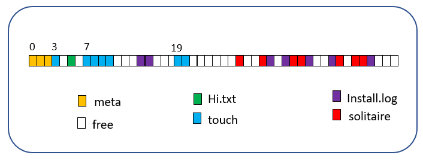
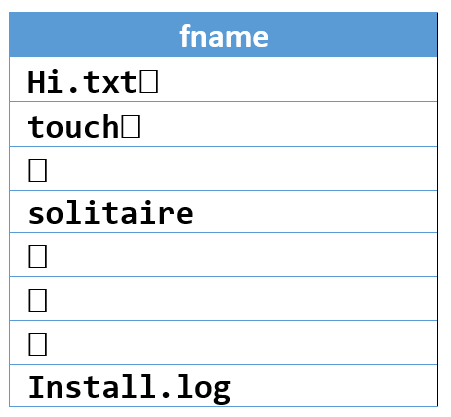

# Unix File System

Efficient Unix file system simulator in C.

[Author: Bill Zhao](www.iambillzhao.com)

## Project Structure

There are three layers to this Unix file system: `fs`, `bfs`, and `bio`.

1. **`fs`**: user-level file system, with functions like `fsOpen`, 
`fsRead`, `fsSeek`, and `fsClose`.

2. **`bfs`**: functions internal to BFS such as `bfsFindFreeBlock`, and 
`bfsInitFreeList`.

3. **`bio`**: lowest level block IO functions: `bioRead` and 
`bioWrite`.

## Included Files

- `alias.h`: a short set of typedefs for u8, i16, str, etc

- `bfs.h`, `bfs.c`: support for Super block, inode, directory and 
Open-File-Table

- `bio.h`, `bio.c` : low-level block IO functions

- `errors.h`, `errors.c` : pretty error messages

- `fs.h`, `fs.c`: user-level filesystem API.

- `p5test.h`, `p5test.c`: the test program used to run tests

- `main.c`: the driver function

## Structure Implementations

The following text may help the client to understand the three 
layers of this file system:

### bio (Block IO Level)

A raw, unformatted BFS disk consists of a sequence of 100 blocks, 
each 512 bytes in size. The BFS disk is implemented on the host 
filesystem as a file called `BFSDISK`. Blocks are numbered from 
0 up to 99. Block 0 starts at byte offset 0 in `BFSDISK`. The next 
block starts at byte offset 512, and so on. Only an entire block 
could be read or written.

These two functions simulate the Unix file system kernel `read` 
and `write`:

- `i32 bioRead(i32 dbn, void* buf)`: read block number dbn from 
the disk into the memory array buf. Return 0 for success. Any 
failure will abort the program.

- `i32 bioWrite(i32 dbn, void* buf)`: write the contents of the 
memory array buf into block number dbn on disk. Return 0 for 
success. Any failure will abort the program.

### fs (User-level file system)

An interface of raw, fixed-size blocks is too primitive for 
regular use. BFS presents a more user-friendly interface: 
one that lets us create files, where “file” is a collection 
of zero or more bytes on disk, reached by a user-supplied name. 
The bytes that comprise the file may be scattered over the 
disk’s blocks, rather than having to occupy a contiguous 
sequence of block numbers. Files can be grown automatically 
as a user writes more and more data into that file.

#### Notes on namings

- `FBN`s are numbers used to describe blocks within a file 
as File Block Numbers

- `DBN`s are numbers used to describe blocks within the BFS 
disk as Disk Block Numbers

Note that both `FBN`s and `DBN`s start at 0.

#### Example of an occupied fs interface

The diagram below shows a sequence of disk blocks, containing 
4 files, called `Hi.txt`, `touch`, `Install.log` and `solitaire`. 
`Hi.txt` is small, and uses up just one disk block (in green). 
`touch` is larger: it uses 7 blocks, spread across the disk. 
Similarly for the other two files. The uncolored blocks are free 
– available to be allocated to future files; or to existing files, 
should they be extended.



- `i32 fsFormat()`: initialize the BFS disk. On success, return 0. 
On failure, abort the program. Note that this function will create 
a new `BFSDISK`. It will destroy any previous `BFSDISK`.

- `i32 fsMount()`: mount an existing BFS disk. On succes, return 0. 
On failure, abort the program.

- `i32 fsOpen(str fname)`: open the file called `fname`. On success, 
return a file descriptor, or `fd`, which can be used to perform subsequent 
operations on that file. On failure, return `EFNF` (File Not Found). 
The byte-offset within the file – the position at which any subsequent 
fsRead or fsWrite operates – is initialized to 0. (Note that str is a 
typedef for char*. See `alias.h` for details).

- `i32 fsRead(i32 fd, i32 numb, void* buf)`: read numb bytes from the 
current cursor in the file currently open on file descriptor `fd`. 
Place the bytes into the memory buffer `buf`. On success, return number 
of bytes read (this may be less than numb if the read operation hits 
end-of-file). On failure, abort the program.

- `u32 fsWrite(i32 fd, i32 numb, void* buf)`: write numb bytes from 
the memory buffer buf into the file currently open on file descriptor 
`fd`, starting at the file’s current cursor. Note that a write to any 
bytes beyond the current length of the file will automatically extend 
the file. On success, return 0. On failure, abort the program. 

- `i32 fsSeek(i32 fd, i32 offset, i32 whence)`: adjust the cursor to 
offset. whence specifies how offset is measured, with values, defined 
in `stdio.h`. SEEK_SET (0) means seek to byte-offset offset from the 
start of the file; SEEK_CUR (1) means add offset to the current byte-offset; 
SEEK_END (2) means add offset from the end of file. On success, return 0. 
On failure, abort the program.

- `i32 fsClose (i32 fd)`: close the file currently open of file 
descriptor `fd`. On success, return 0. On failure, abort the program.

- `i32 fsSize(i32 fd)`: return the size, in bytes, of the file 
currently open on file descriptor fd. On failure, abort the program.

- `i32 fsTell(i32 fd)`: return the current cursor. On failure, 
abort the program.

### bfs (Raw IO level)

The BFS interface provides all the functions required to create 
and maintain the filesystem. BFS uses certain blocks – which we 
will call metablocks – at the start of the BFS disk, to remember 
where all its files are stored, and to keep track of all free 
blocks. These metablocks are not visible to the programmer via 
the fs interface.

There are 3 metablocks: `SuperBlock`, `Inodes`, and `Directory`, 
occupying the DBNs 0, 1 and 2 of the BFS disk:

#### SuperBlock

Always DBN 0 in `BFSDISK`. Holds 4 numbers that characterize the disk:

- `numBlocks`: total number of blocks in `BFSDISK`: always 100

- `numInodes`: total number of inodes in `BFSDISK`: always 8

- `numFree`: total number of free block in `BFSDISK`

- `firstFree`: DBN of the first free block in `BFSDISK`

The freelist is kept as a **linked list**: the first u16 cell in each 
free block holds the block number of the next free block. 
(u16 is a typedef for a 16-bit unsigned integer. See `alias.h` for details)

#### Inode

The diagram below shows the Inode for file touch 
(the Inode is 16 bytes long):



The direct array provides a mapping between FBN and corresponding 
DBN, for the first 5 FBNs of the file. 

So: DBNs 3, 8, 7, 20 and 10 in that order. 

The indirect field holds the DBN of the `indirect block`. 
This is a single block that holds 256 i16 values, that record 
the next 256 DBNs for the file. The indirect block uses the same 
convention as the Inode – entries with value 0 mean there is no 
corresponding disk block. The following diagram shows the first 
few i16 entries in the indirect block at DBN 22:


In total, file touch occupies DBNs 3, 8, 7, 20, 10 , 9 and 19, in that order. 

A single inode can map a file of up to 5 FBNs. 
And the indirect block can map a further 256 FBNs. So the 
largest file that BFS supports is (5 + 256) = 261 blocks.

#### Directory


The Directory holds 8 names. The index of the name within the 
Directory, starting at 0, tells us the file’s Inode number – 
hereafter called its `Inum`. For example, the file called `Install.log`
has Inum 7. Unused entries in the Directory (not yet used, 
or used for a file that was subsequently deleted), are denoted 
by an empty file name. The Directory fits within its own single 
metablock on disk. 

## Write Rules

A write to a file falls into one of three cases that we describe 
as inside, outside and overlap.

Inside means that the write fits within the existing file. There 
is no need to extend the existing file:


Outside means the write fits beyond the range of the existing file. 
This requires that new blocks are added to the file. Any region not 
explicitly written – the gap between existing and new – must be set 
to zeroes.


Overlap means the write fits covers part of the existing file, but 
extends beyond its current limit. This requires that new blocks are 
added to the file.


## Tests Included

The following 6 tests will examine the program file's integrity and 
functionality:

- `TEST 1`: Read 100 bytes from start of file

- `TEST 2`: Read 200 bytes, from FBN 1, at cursor = 30

- `TEST 3`: Read 1,000 bytes from start of DBN 20 (spanning read)

- `TEST 4`: Write 77 bytes, starting at 10 bytes into FBN 7

- `TEST 5`: Write 900 bytes, starting at 50 bytes into DBN 10

- `TEST 6`: Write 700 bytes, starting at FBN 49. (This write extends the file)

## Desired Output

A correct run of the program will produce the following output:

```
TEST 1 : GOOD
TEST 1 : GOOD
TEST 1 : GOOD
TEST 2 : GOOD
TEST 2 : GOOD
TEST 2 : GOOD
TEST 3 : GOOD
TEST 3 : GOOD
TEST 3 : GOOD
TEST 3 : GOOD
TEST 4 : GOOD
TEST 4 : GOOD
TEST 4 : GOOD
TEST 4 : GOOD
TEST 4 : GOOD
TEST 5 : GOOD
TEST 5 : GOOD
TEST 5 : GOOD
TEST 5 : GOOD
TEST 5 : GOOD
TEST 5 : GOOD
TEST 5 : GOOD
TEST 5 : GOOD
TEST 6 : GOOD
TEST 6 : GOOD
TEST 6 : GOOD
TEST 6 : GOOD
TEST 6 : GOOD
TEST 6 : GOOD
TEST 6 : GOOD
```